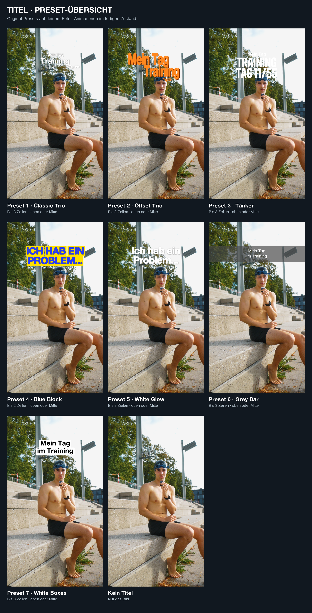
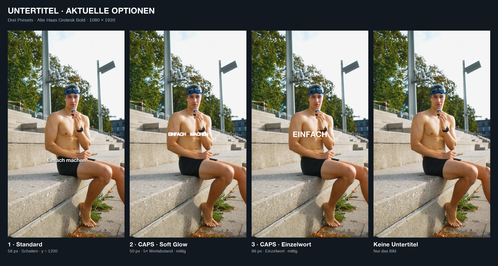

# Ideas by Ferdi

**Von der Idee zum fertigen Video:** lokale Skills für Storytelling, Schnitt und Research.

## Welcher Skill macht was?

| Skill | Dein Material → Ergebnis |
| --- | --- |
| [Video Editor · Single Shot](skills/short-form-video-editing/ideas-by-ferdi-video-editor/SKILL.md) | Ein Sprechvideo → bereinigter Talking Head mit wählbaren Texten, Musik, Zooms und B-Roll. Steuert auch den gemeinsamen Intake. |
| [Multi-Video](skills/short-form-video-editing/ideas-by-ferdi-multi-video/SKILL.md) | Mehrere Sprechclips → zusammenhängender Schnitt mit Perspektivwechseln. |
| [Voiceover](skills/short-form-video-editing/ideas-by-ferdi-voiceover/SKILL.md) | Eine Sprachdatei + Tagesclips → Bilder passend zur Erzählung. **Story-Match vor schnellen Cuts**, optional FlashShutterIntro. |
| [Time Activity Montage](skills/short-form-video-editing/time-activity-montage/SKILL.md) | Tagesclips ohne Voiceover → Musikmontage mit **Uhrzeit \| Aktivität**. Eigener Intake. |
| [Long-Form](skills/long-form-video-editing/SKILL.md) | YouTube-Material → chronologischer Rohschnitt; alternativ einen vorhandenen Schnitt mit Texten, B-Roll und Sound ausgestalten. |
| [Storytelling](skills/short-form-ideas-by-ferdi-storytelling/SKILL.md) | Echte Erlebnisse und Notizen → Hook, Skript und Story-Aufbau. |
| [Research](skills/short-form-social-media-research/SKILL.md) | Thema → öffentliche Trends, Formate und belegbare Hooks. |
| [B-Roll-Import](skills/b-roll-import/SKILL.md) | Ausgewählte Clips → geprüfte, benannte und katalogisierte Bibliotheksausschnitte. |

## Loslegen

```text
Bitte editiere <Projektname> als Voiceover.
Bitte editiere <Dateiname> als Talking Head Single Shot.
Bitte erstelle <Projektname> als Time Activity Montage ohne Voiceover.
```

Bei Single, Multi und Voiceover: **Format → Look & Audio → Dateien & Ausnahmen**. Drei kurze Fragerunden, danach Schnitt. Bereits genannte Antworten werden übernommen.

## Titel & Untertitel

Gleiche Auswahl für Single, Multi und Voiceover. Titelnummer und Untertitelnummer sind unabhängig. **Vorschau anklicken zum Vergrößern.**

<table>
<tr><th>Titel · 7 Presets</th><th>Untertitel · 3 Presets</th></tr>
<tr>
<td valign="top"><a href="docs/presets/titel_presets.png"></a></td>
<td valign="top"><a href="docs/presets/untertitel_presets.png"></a><br><br>1 · Standard<br>2 · CAPS Soft Glow<br>3 · CAPS Einzelwort<br><br>Auch ohne Titel oder Untertitel möglich.</td>
</tr>
</table>

**Titel:** 1 Classic Trio · 2 Offset Trio (orange) · 3 Tanker · 4 Blue Block · 5 White Glow · 6 Grey Bar/Snapchat · 7 White Boxes/Max-Readable.

<details>
<summary>Titelvorlage & Timing aufklappen</summary>

```text
Titel: Preset 1
Position: oben
Zeile 1: TUM + 8 Trainings die Woche
Zeile 2: Halbmarathon Prep
Zeile 3: trotzdem komplett unoptimiert
Untertitel: 3 CAPS Einzelwort
```

Preset 4/5 haben zwei Zeilen, die anderen drei. `leer` lässt einen Slot frei. Font, Größenverhältnis und Animation bleiben im gewählten Preset fest.

- **Oben:** 5 s + 0,3 s Fade; Untertitel sofort.
- **Mitte:** insgesamt 2,5 s; Untertitel danach.
- **Kein Titel:** Untertitel sofort.

</details>

[Alle Copy-paste-Aufträge, Preset-Beispiele und technischen Details →](docs/vorlagen.md)

## Was der Schnitt beachtet

- **Voiceover:** Das gezeigte Motiv bleibt bei der gesprochenen Sache – auch länger, gerne mit mehreren Ausschnitten derselben Datei. Chronologie wird abgefragt; nicht jeden Clip zwanghaft einbauen.
- **Sprache:** Pausen und verworfene Takes bereinigen, Wörter erhalten. Social-Standard etwa −14 LUFS, maximal −1 dBTP im Export.
- **Musik & Look:** automatische Library-Rotation, dezente Musik, bestätigte Handy-/Kamerafarben. Projektausnahmen haben Vorrang.
- **Kontrolle:** Sprachinhalt, Bild-Match, Lesbarkeit und technische Ausgabe prüfen. Revisionen als neue Version, Originale sichern.

## Wo liegt was?

| Ordner neben diesem Repository | Inhalt |
| --- | --- |
| `projects/unfinished/<format>/<projekt>/` | Rohmaterial |
| `projects/work_projects/<format>/<projekt>/` | Analyse und Rendercache |
| `projects/finished/<format>/<projekt>/` | Final, Plan und gesicherte Originale |
| `b_roll/` | Gemeinsame Medienbibliothek |
| `songs_fonts_luts/` | Musik, Fonts, LUTs und SFX |

`<format>` ist `short_form` oder `long_form`. Lokal werden Python/uv, FFmpeg, Purfview Medium und die benötigten Medien benötigt; kein ElevenLabs-Key. Long-Form kann zusätzlich Remotion nutzen.

**Hinweis:** Die Übersicht beschreibt den lokalen Workspace. Noch nicht veröffentlichte Skills sowie persönliche Medien, Modelle und lokale Pfadverknüpfungen kommen nicht automatisch mit einem Clone. Verbindlich sind die jeweiligen Skill-Dateien.
